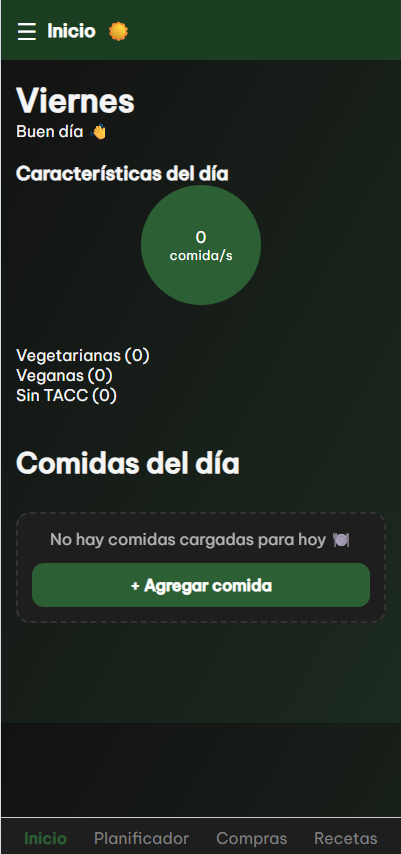
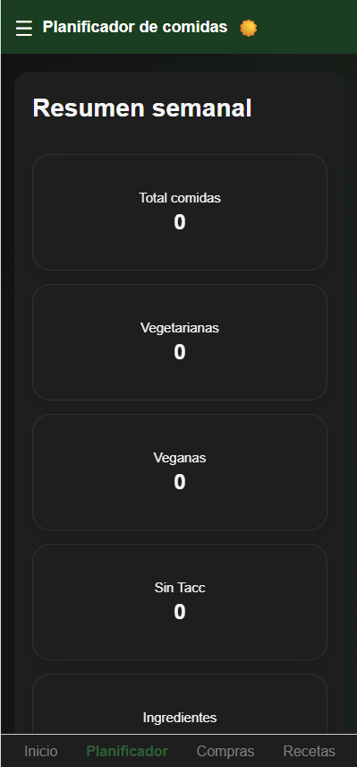
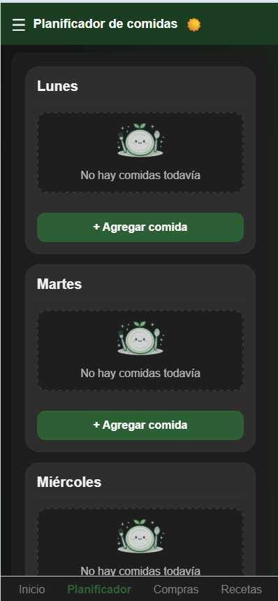
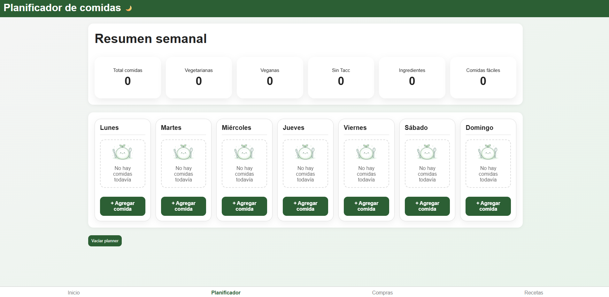
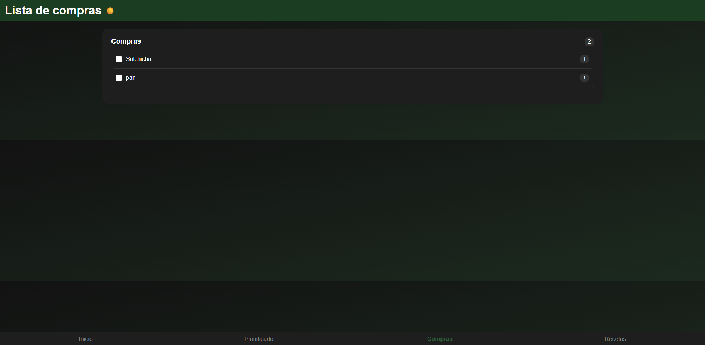

# TUPTN-Programacion-II-TP

Aplicación web desarrollada para organizar comidas semanales, administrar recetas y generar listas de compras automáticamente.

# Funcionalidades principales

## Planificador semanal
- Organización de comidas por día
- Agregar comidas al planner
- Editar y eliminar comidas
- Persistencia de datos mediante LocalStorage

## Gestión de recetas
- Recetas precargadas
- Visualización de ingredientes y pasos
- Modal interactivo de recetas

## Lista de compras automática
- Generación automática de ingredientes necesarios
- Agrupación de productos
- Marcado de productos completados

## Dark Mode persistente
- Cambio entre modo claro y oscuro
- Persistencia del tema utilizando LocalStorage

## Diseño responsive
Adaptado para:
- Desktop
- Tablet
- Celular

## Mejoras UX/UI
- Animaciones con CSS (@keyframes)
- Hover y transiciones suaves
- Feedback visual en formularios
- Menú hamburguesa responsive
- Accesibilidad mínima con aria-label y labels asociados

---

# Tecnologías utilizadas

- HTML5
- CSS3
- JavaScript
- LocalStorage
- Flexbox
- CSS Grid

## Screenshots

# Responsive mobile

## Inicio

## Planificador

## Formulario

## Compras

## Recetas

