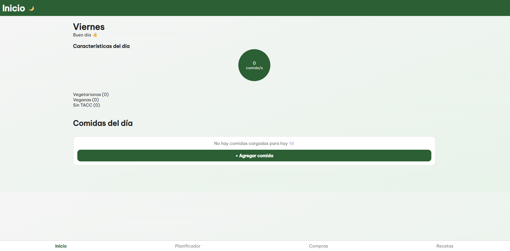
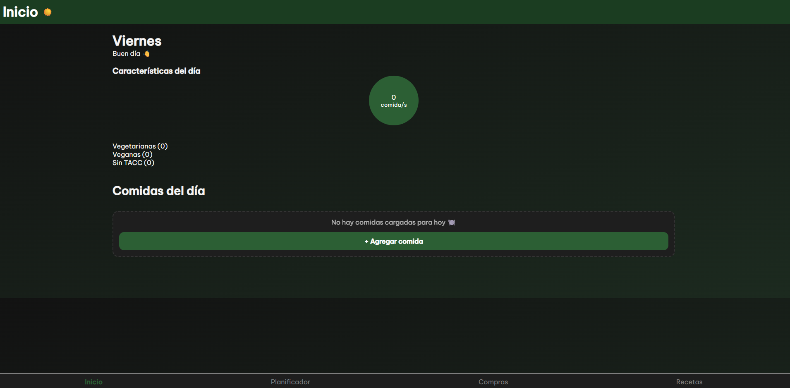
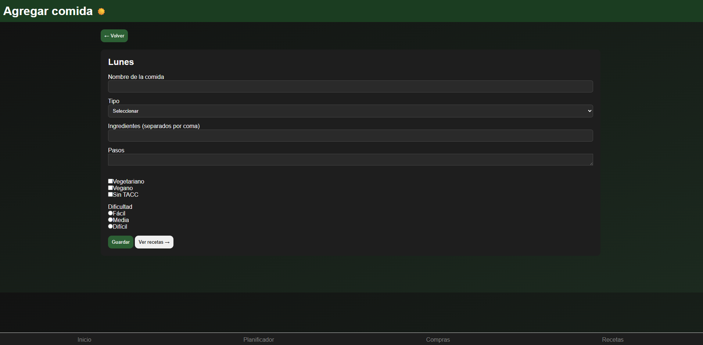
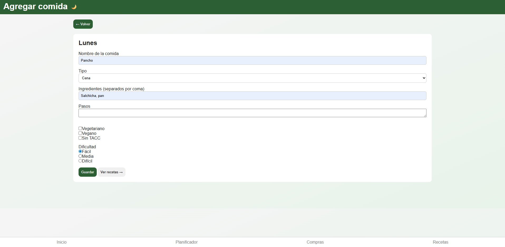
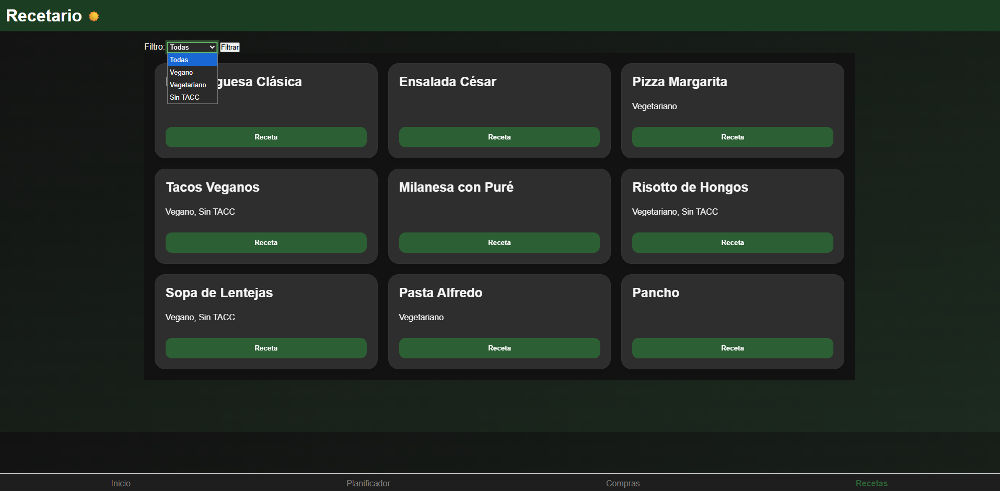
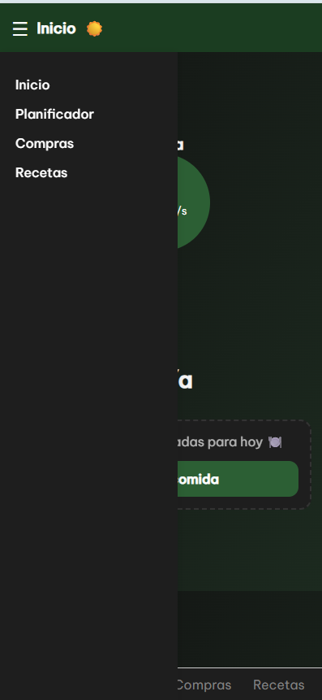
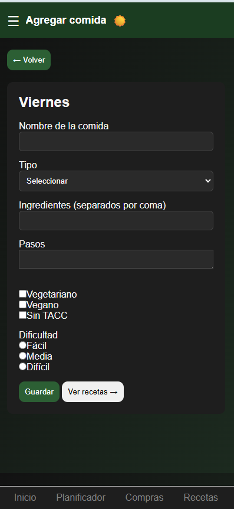

# TP Programación II - TUPTN

Aplicación web responsive para organizar comidas semanales, administrar recetas y generar listas de compras automáticamente.


---

## Funcionalidades principales

### Planificador semanal

- Organización de comidas por día
- Agregar comidas al planner
- Editar y eliminar comidas
- Persistencia de datos mediante LocalStorage

### Gestión de recetas

- Recetas precargadas
- Visualización de ingredientes y pasos
- Modal interactivo de recetas

### Lista de compras automática

- Generación automática de ingredientes necesarios
- Agrupación de productos
- Marcado de productos completados

### Dark Mode persistente

- Cambio entre modo claro y oscuro
- Persistencia del tema utilizando LocalStorage

### Diseño responsive

Adaptado para:
- Desktop
- Tablet
- Celular

### Mejoras UX/UI

- Animaciones con CSS (@keyframes)
- Hover y transiciones suaves
- Feedback visual en formularios
- Menú hamburguesa responsive
- Accesibilidad mínima con aria-label y labels asociados

---

## Tecnologías utilizadas

- HTML5
- CSS3
- JavaScript
- LocalStorage
- Flexbox
- CSS Grid

---

## Cómo ejecutar el proyecto

1. Clonar el repositorio:

```bash
git clone <URL_DEL_REPOSITORIO>
```

2. Abrir la carpeta del proyecto.

3. Ejecutar el archivo `index.html` en el navegador.

> Recomendado: utilizar la extensión **Live Server** de Visual Studio Code para una mejor experiencia de desarrollo.

---

## Screenshots

### Inicio





---

### Planificador




---

### Formulario



---

### Compras


---

### Recetas



---

### Responsive mobile







---

## Integrantes 
- Picierro Julia
- Lopez Joaquin
- Rodriguez Julieta 